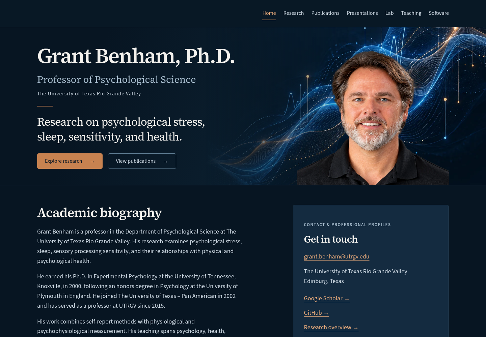
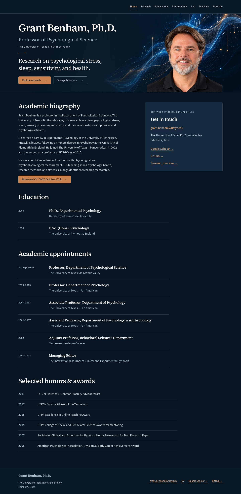
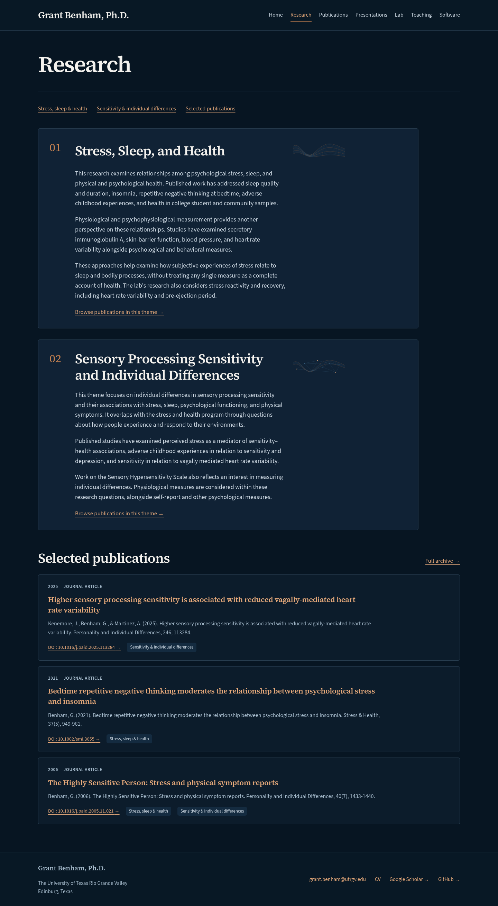
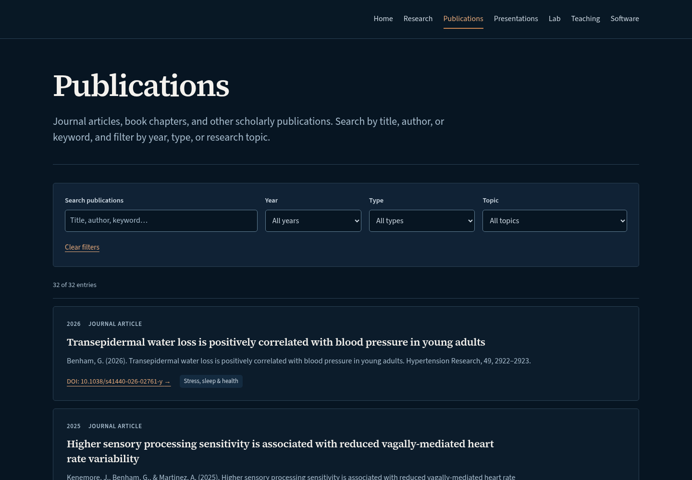
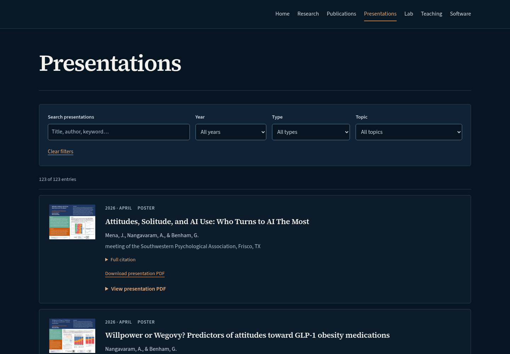
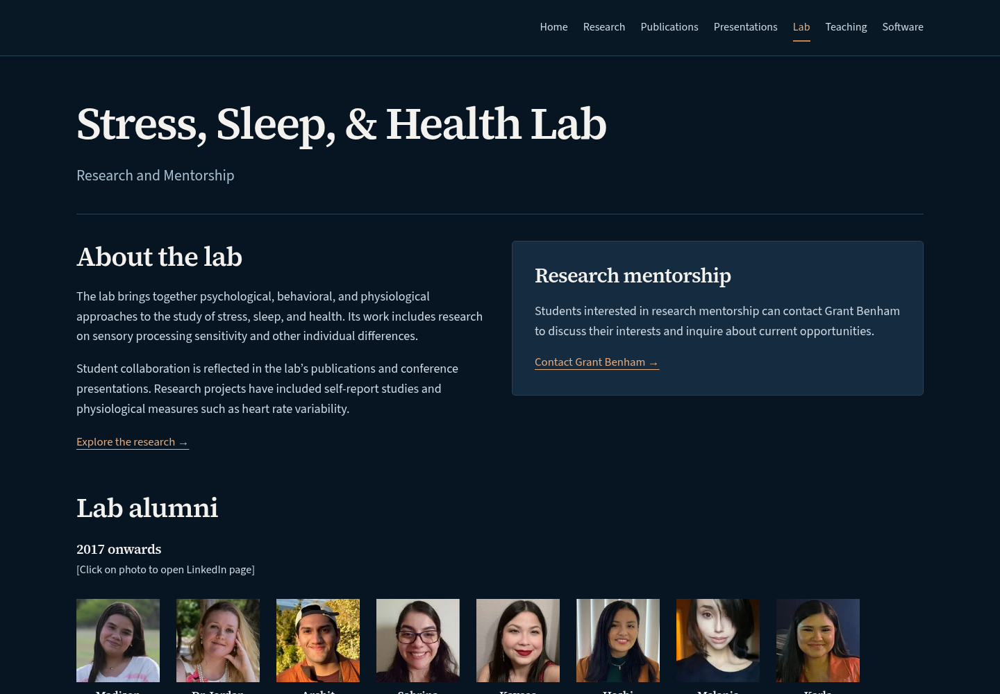
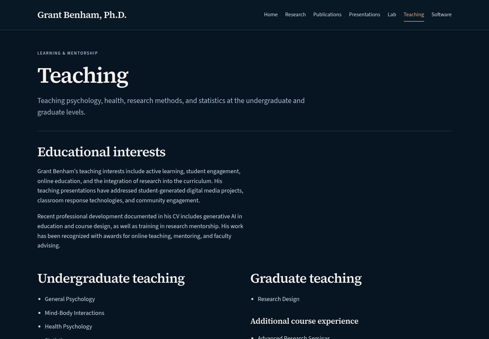
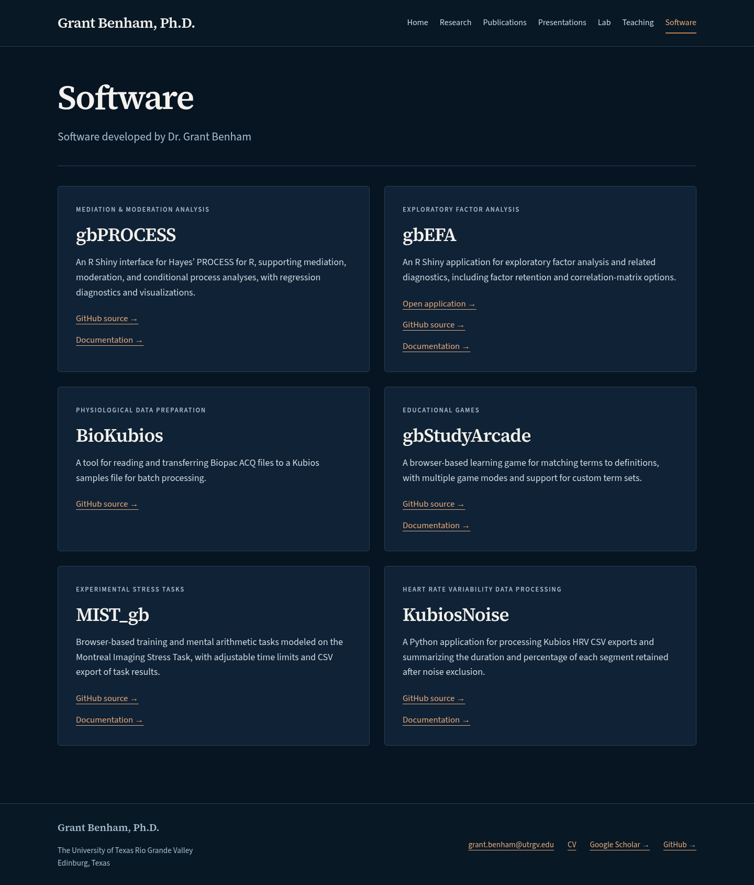
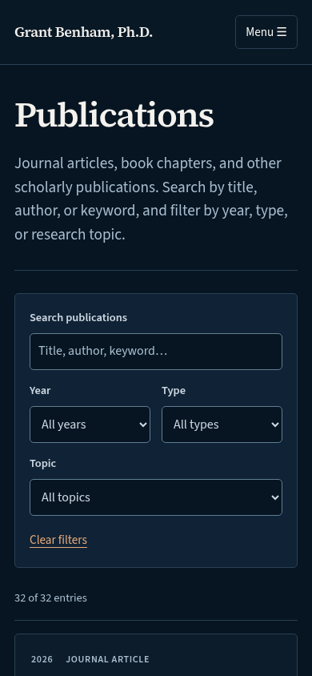
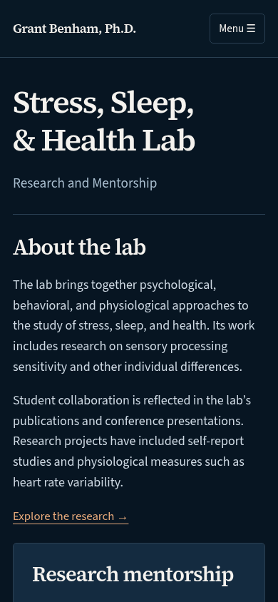

# Dark design experiment — review before publication

The public website remains the white version. This design is saved only on `dark-design-experiment`; it has not been merged or published.

## Review in your browser — no installation required

Scroll through the screenshots below on GitHub. Click an image to enlarge it. These are screenshots of the working experimental website, rather than new mockups. Links and filters inside a screenshot cannot be clicked. Nothing you do on this review page replaces the public website.

### Home introduction — desktop



### Home introduction — mobile


### Full homepage

The existing biography, education, appointments, awards, and contact information remain below the introduction.



### Research



### Publications



### Presentations



### Lab



### Teaching



### Software



### Additional mobile views





[Full mobile homepage screenshot](dark-preview/home-mobile.png)

## What changed

Navy backgrounds, off-white serif headings, pale blue-gray body text, copper links and buttons, thin borders, and consistent dark cards and search controls. Behind the head-and-collar portrait, generated abstract artwork combines layered luminous blue and copper rhythm ribbons with pulse-like peaks and fine measurement-inspired details. The background fades out beside the text; the portrait is cropped just below the open collar and sits flush with the hero’s lower edge. The research headings retain their small decorative wave illustrations. There are no campus photographs, institutional logos, new marketing statements, animations, or image color filters.

Following your latest revision, the name/link at the upper left is removed. The plain-text footer requested in the redesign brief remains. The seven menu destinations, Teaching-before-Software order, combined Home/About content, alumni order and 120-pixel photos, software selection, and archive functionality are preserved.

Central colors, surfaces, typography, spacing, radius, gradient, and shadow settings live in `src/styles/theme.css`. Layout rules remain in `src/styles/global.css`. There is no theme toggle or new framework.

## Checks completed

- Astro validation: no errors or warnings. Static build and internal link/asset/anchor checks passed for all nine generated HTML routes, including the legacy About redirect and 404 page.
- All 17 browser tests passed. These exercise navigation, publication and presentation search/filter/reset, PDF download and lazy viewer, CV and portrait, alumni profiles, and operation without JavaScript.
- Automated WCAG A/AA checks passed on all seven main pages and the open mobile menu. Layouts checked at 1440, 768, 390, and 320 pixels wide with no horizontal overflow.
- Main text and link destinations are preserved on all seven pages. Image paths are unchanged except for the intentionally revised homepage portrait. Structured content data, original media, dependency files, and deployment workflows remain unchanged.
- The six linked software repositories were reachable through GitHub. The unchanged gbEFA application URL accepted a GET request (HTTP 202); the external application itself was not functionally tested. External Google Scholar and a sampled DOI destination reject automated requests in this environment; their unchanged destinations were preserved. Automated accessibility checks do not replace a full human accessibility audit.
- Screenshots were generated from the built website and visually inspected. The new portrait is an AI-generated transparent cutout derived from your supplied dark mockup, tightly cropped to the head and collar and saved as responsive WebP assets. The generated abstract backdrop is supplied at 1536- and 768-pixel widths (approximately 145 KB and 39 KB). Its likeness is part of this design review. The original white-site portrait is retained in the repository for recovery.
- The public homepage was compared byte for byte before and after the work and remains unchanged.

## Interactive preview — optional, for someone running the site locally

For visual approval, the screenshots above are sufficient. To try search, navigation, and PDF controls yourself, download the `dark-design-experiment` branch from GitHub: choose that branch, then **Code → Download ZIP**, and extract it. This does not publish anything.

A computer with Node.js 24 or later is required. Open a terminal in the extracted folder and run:

```sh
npm ci
npm run dev -- --ignore-lock
```

Open the local address printed by Astro in that computer's browser. Stop it with Ctrl+C. This local server cannot replace GitHub Pages. Codex's file viewer is not a working website preview; opening a built HTML file directly there will not load all site assets.

For a maintainer reproducing screenshots: build the site, run its preview server on port 4321, and run `node scripts/capture-dark-preview.mjs`.

## Approval and recovery

The public white version is commit `cc11462fa214dd70dda695ecfb902c993a2c7fe3`, saved on GitHub under `pre-dark-redesign-2026-10`. The publish workflow remains manual and only builds `main`; it cannot publish this experimental branch. No deployment settings were changed.

If you approve this version, ask to merge and publish it. Until then, the branch and pull request remain separate from the live website. If you later want the white design restored, ask to restore the backup tag and publish that version. The original remains recoverable in Git history.
