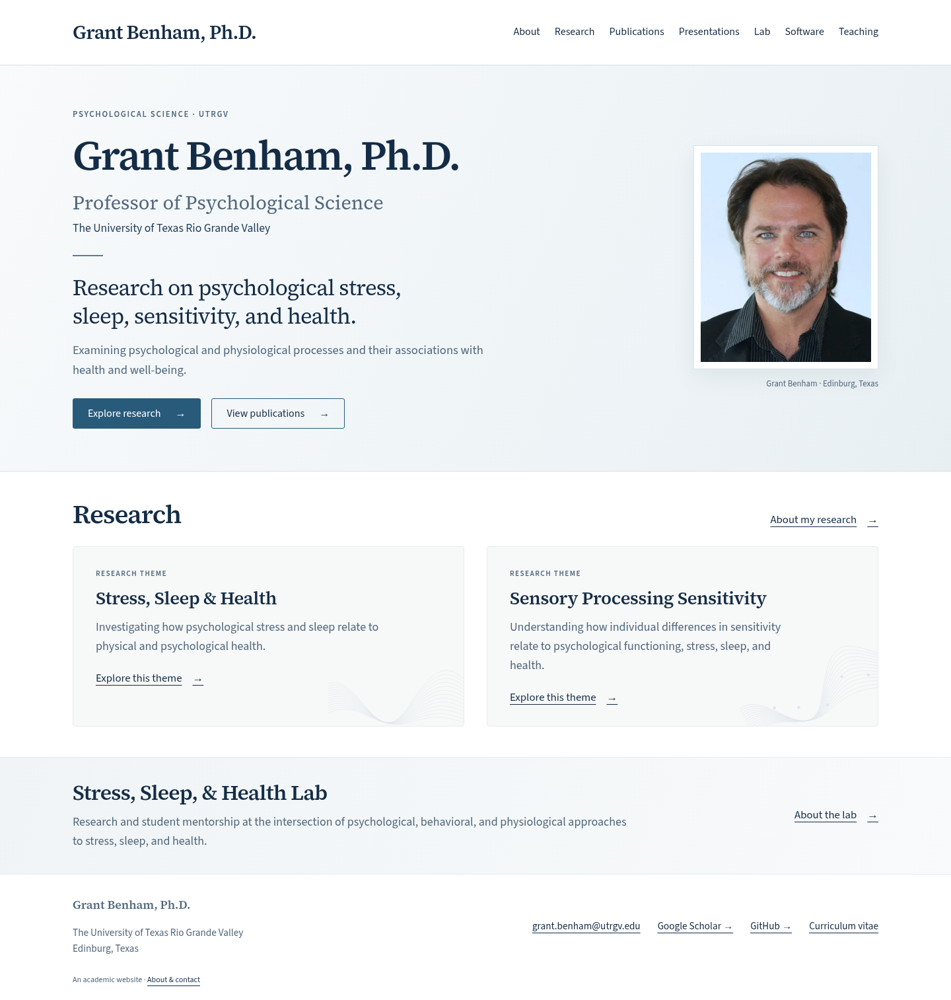
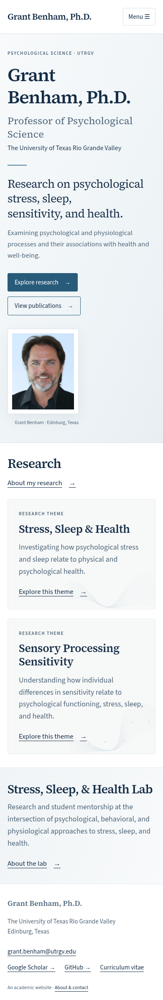
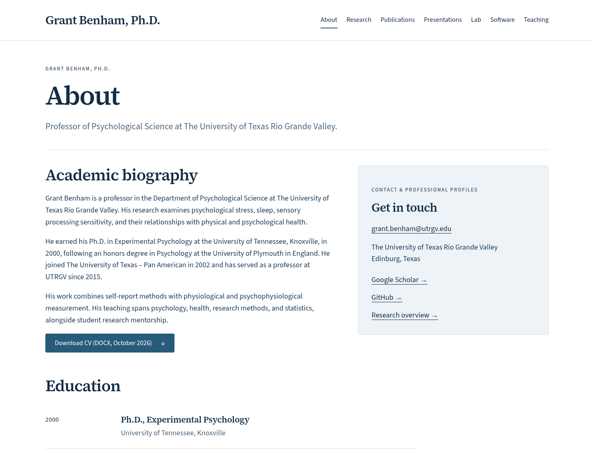
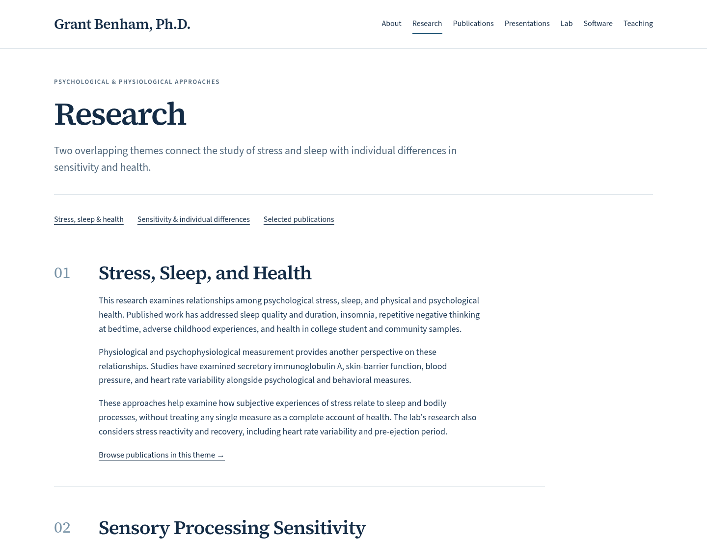
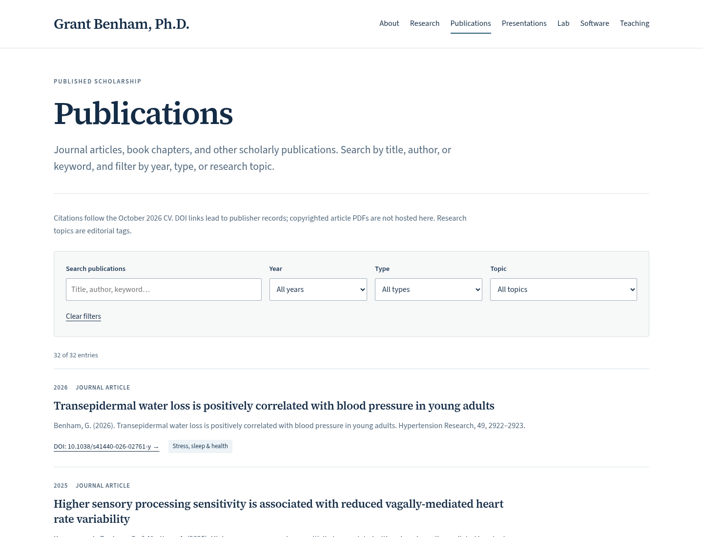
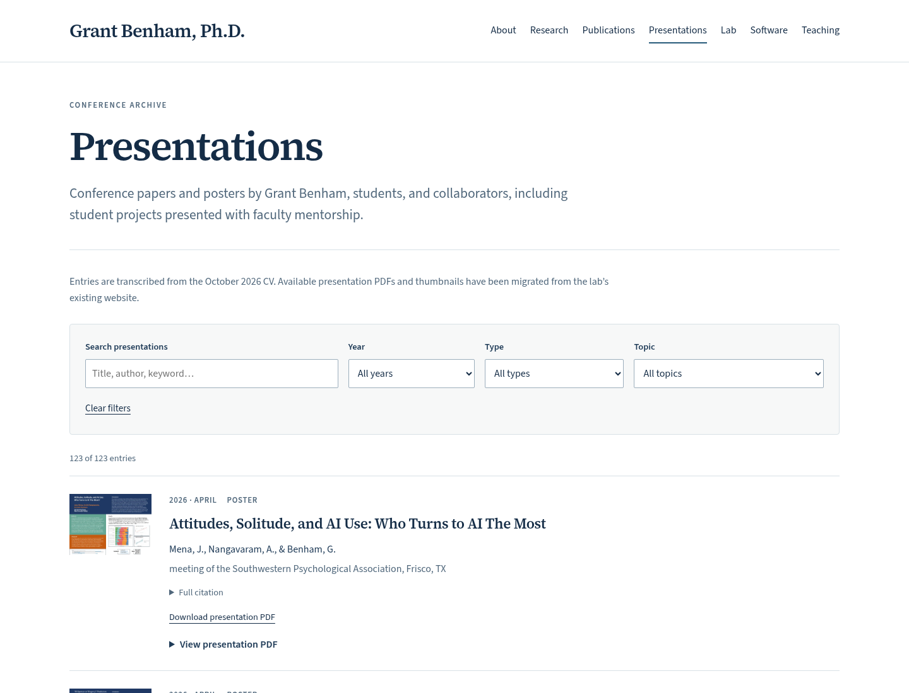
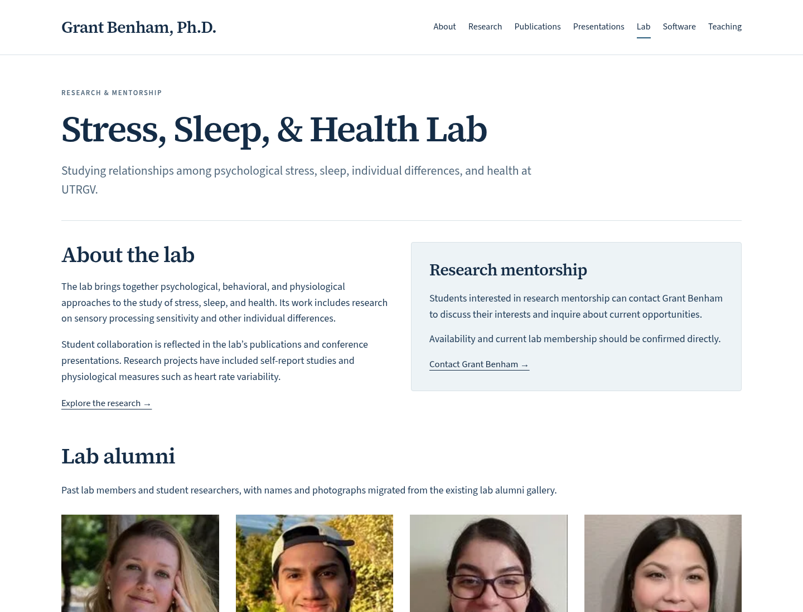
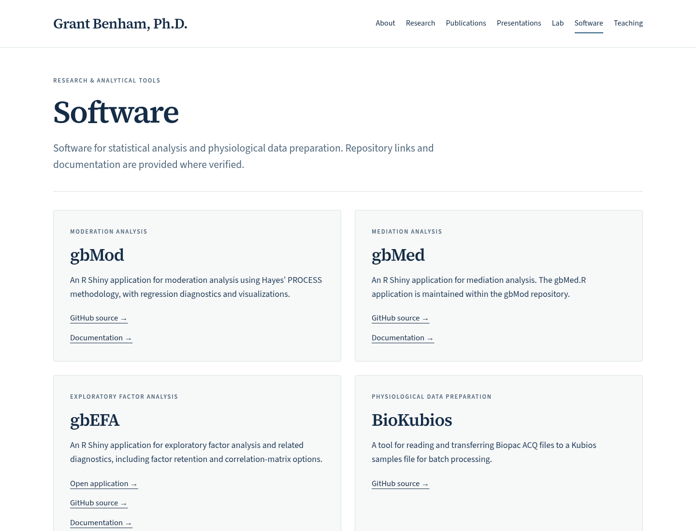
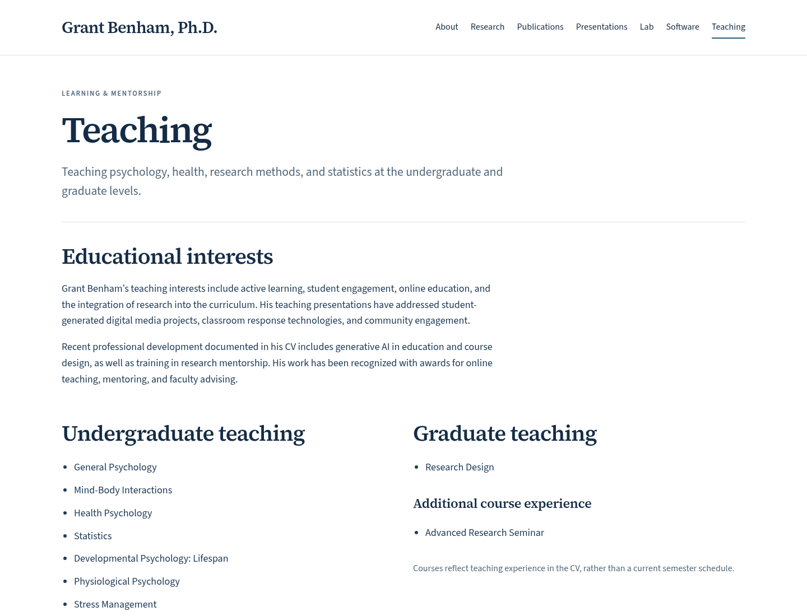

# Website design preview

These screenshots show the built website and can be viewed directly on GitHub. The website is now live at **https://grantbenham.github.io/**. These screenshots show the earlier review version. Screenshots are static; to test links, search, filters, or PDF viewing, download the repository and run it locally as explained in README.md.

The homepage screenshots show the full page. The other desktop screenshots show the first screen; additional content continues below. The portrait is the recovered Weebly original and can be replaced with the newer portrait supplied in chat once its original file is available.

## Home — desktop

## Home — mobile

## About

## Research

## Publications

## Presentations

## Lab

## Software

## Teaching

