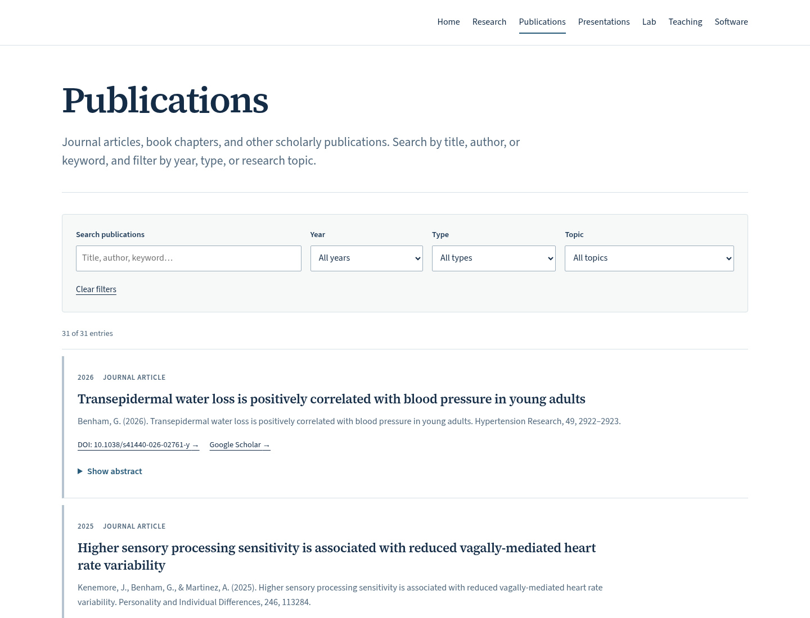
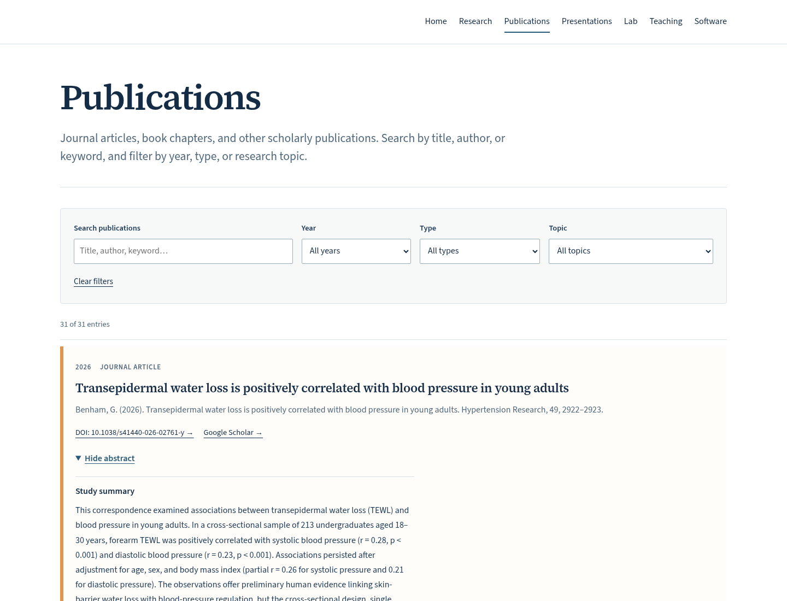
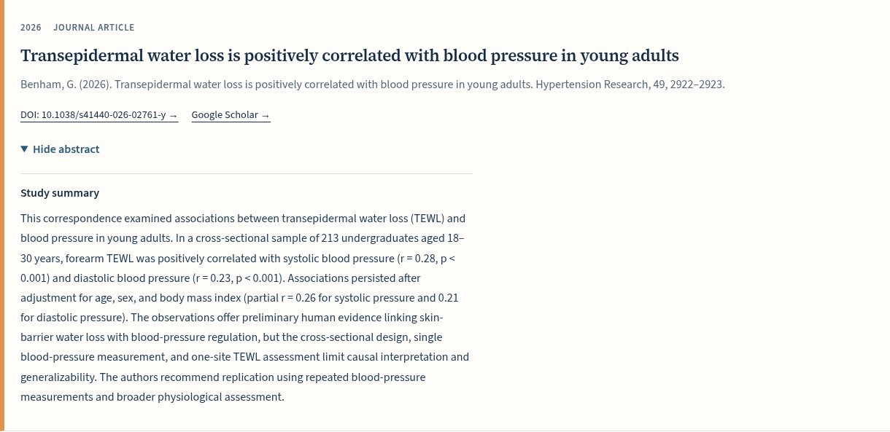
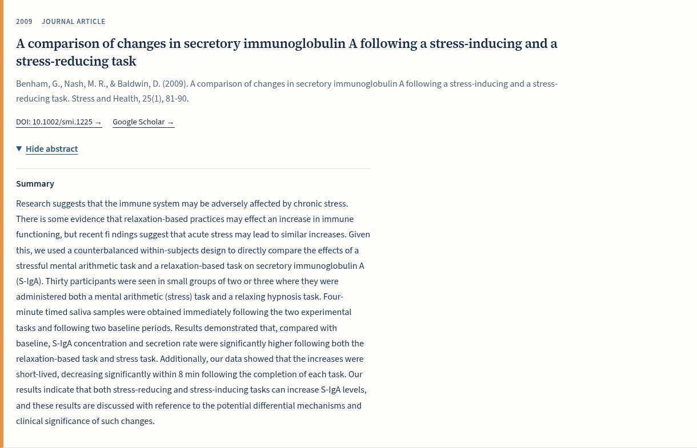
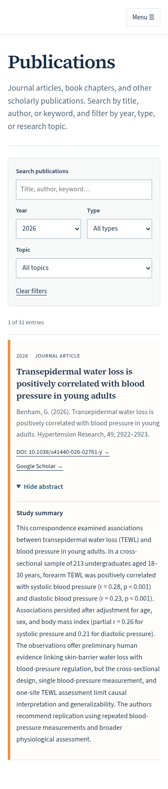
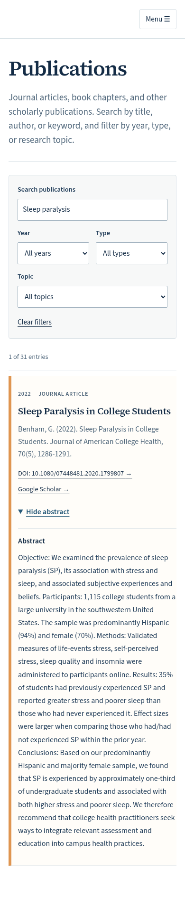

# Publication abstracts — review before publication

**22 of 22 abstracts matched by DOI.** No unmatched records and no title-only matches. This branch is based on the current clean white version on `main` (`cc11462`). Nothing has been merged or published.

## Desktop — collapsed entries

## Desktop — expanded abstract

## Complete 2026 study summary

## Author-labeled summary

## Mobile — collapsed

## Mobile — full expanded study summary

## Mobile — search and expanded abstract

## Changes and preservation

- All 22 supplied texts are stored unchanged in `src/data/publication-abstracts.json`, linked by stable publication ID after DOI matching. Native inline disclosures show “Show abstract” and “Hide abstract,” and work without JavaScript.
- Expanded publication entries have a 6-pixel light/mid-orange left bar and a very light warm background. Collapsed entries have a subtle 4-pixel blue-gray bar. The white theme remains.
- The 2026 blood-pressure correspondence displays the supplied study summary; the 2009 S-IgA paper displays the supplied author-labeled Summary. Other supplied abstracts/overview text are also included in full.
- “Ask the brains: Hypnosis” is removed entirely. The incorrect DOI for “The truth and the hype of hypnosis” is removed. The “Hypnosis” book chapter has no DOI link (it already had no DOI in the current main data). Both have targeted Google Scholar searches; the generic “Hypnosis” chapter query includes Benham, Nash, and Oken to distinguish it.
- The archive has 31 entries and 22 abstracts. No duplicates were added. Citations, publication years, ordering, IDs, and the existing search and Year/Type/Topic filters are preserved. Abstract text does not change the existing search matching rules.
- DOI links remain where supplied, and each entry has a title-targeted Google Scholar search. Publication entries have no PDF links, PubMed links, or research-topic badges. Topic metadata remains available to the existing filter. The Research page’s compact selected-publication cards remain unchanged.
- Original PDFs were not included in the supplied ZIP and no PDFs were uploaded. The attached metadata was treated as source material; the abstract text is reproduced as supplied rather than silently proofread or scientifically reinterpreted.

## Validation

- Astro check and static build passed; internal links, asset paths, anchors, and unique IDs checked across all nine generated HTML routes.
- All 21 browser tests passed: every complete abstract, open/close labels, keyboard Enter/Space operation, orange/blue-gray states, filtering/reset while entries are expanded, unchanged citations and order, Scholar queries, mobile layouts down to 320 pixels, and disclosures without JavaScript.
- Existing publication and presentation searches, filters, PDF viewing, CV download, navigation, and alumni checks also passed. Automated WCAG A/AA checks passed, including an expanded abstract.
- Screenshots above are generated from the working white-theme build. Screenshots illustrate layout; they are not interactive previews.

## Matching record

| Publication | Existing ID | Match |
|---|---|---|
| Transepidermal water loss is positively correlated with blood pressure in young adults | `pub-2026-01` | DOI `10.1038/s41440-026-02761-y` |
| Higher sensory processing sensitivity is associated with reduced vagally-mediated heart rate variability | `pub-2025-02` | DOI `10.1016/j.paid.2025.113284` |
| Recent stressful life events and perceived stress as serial mediators of the association between adverse childhood events and insomnia | `pub-2025-04` | DOI `10.1080/08964289.2024.2335175` |
| Adverse childhood experiences moderate the association between sensory processing sensitivity and depression | `pub-2024-03` | DOI `10.1007/s12144-024-06847-z` |
| Heart rate variability biofeedback as a treatment for military PTSD: A meta-analysis | `pub-2024-05` | DOI `10.1093/milmed/usae003` |
| The pathway from sensory processing sensitivity to physical health: Stress as a mediator | `pub-2023-06` | DOI `10.1002/smi.3250` |
| A comparison of psychological stress and sleep problems in undocumented students, DACA recipients, and U.S. citizens | `pub-2022-07` | DOI `10.1007/s10903-021-01315-3` |
| Bedtime repetitive negative thinking moderates the relationship between psychological stress and insomnia | `pub-2021-08` | DOI `10.1002/smi.3055` |
| Stress and sleep in college students prior to and during the COVID-19 pandemic | `pub-2021-09` | DOI `10.1002/smi.3016` |
| Sleep paralysis in college students | `pub-2020-10` | DOI `10.1080/07448481.2020.1799807` |
| Stress and sleep remain significant predictors of health after controlling for negative affect | `pub-2018-12` | DOI `10.1002/smi.2840` |
| The Sleep Health Index: Correlations with standardized stress and sleep measures in a predominantly Hispanic college student population | `pub-2019-11` | DOI `10.1016/j.sleh.2019.07.007` |
| An examination of the equivalency of self-report measures obtained from crowdsourced versus undergraduate student samples | `pub-2016-15` | DOI `10.3758/s13428-016-0710-8` |
| Short sleep duration is associated with obesity in Hispanic manufacturing workers | `pub-2017-14` | DOI `10.1353/hpu.2017.0115` |
| The association between body mass index and sleep in a predominantly Hispanic college population | `pub-2017-13` | DOI `10.1177/0739986317707721` |
| Development of the Sensory Hypersensitivity Scale (SHS): A self-report tool for assessing sensitivity to sensory stimuli | `pub-2016-16` | DOI `10.1007/s10865-016-9720-3` |
| Skin barrier recovery is not associated with self-perceived stress | `pub-2016-17` | DOI `10.1002/smi.2640` |
| Sleep: An important factor in stress-health models | `pub-2010-18` | DOI `10.1002/smi.1304` |
| A comparison of changes in secretory immunoglobulin A following a stress-inducing and a stress-reducing task | `pub-2009-19` | DOI `10.1002/smi.1225` |
| Effect of Healing Touch on stress perception and biological correlates | `pub-2008-21` | DOI `10.1097/01.HNP.0000312659.21513.f9` |
| The shape of stress: The use of frequent sampling to measure temporal variation in S-IgA levels during acute stress | `pub-2007-22` | DOI `10.1002/smi.1150` |
| The Highly Sensitive Person: Stress and physical symptom reports | `pub-2006-26` | DOI `10.1016/j.paid.2005.11.021` |

## Review and publication

The work is isolated on `publication-abstracts-review`. The manual deployment workflow and `main` are unchanged. The branch cannot publish through the workflow, which is restricted to `main`. Approval is required before merging or publication.

A direct request to the public website returned an access error in this environment. GitHub confirmed that `main` and the most recent successful publication remain at `cc11462`; no deployment was triggered for this review. The working local build and browser tests were completed as described above. Google Scholar URLs are targeted searches, rather than claims of independently verified Scholar record identifiers.
