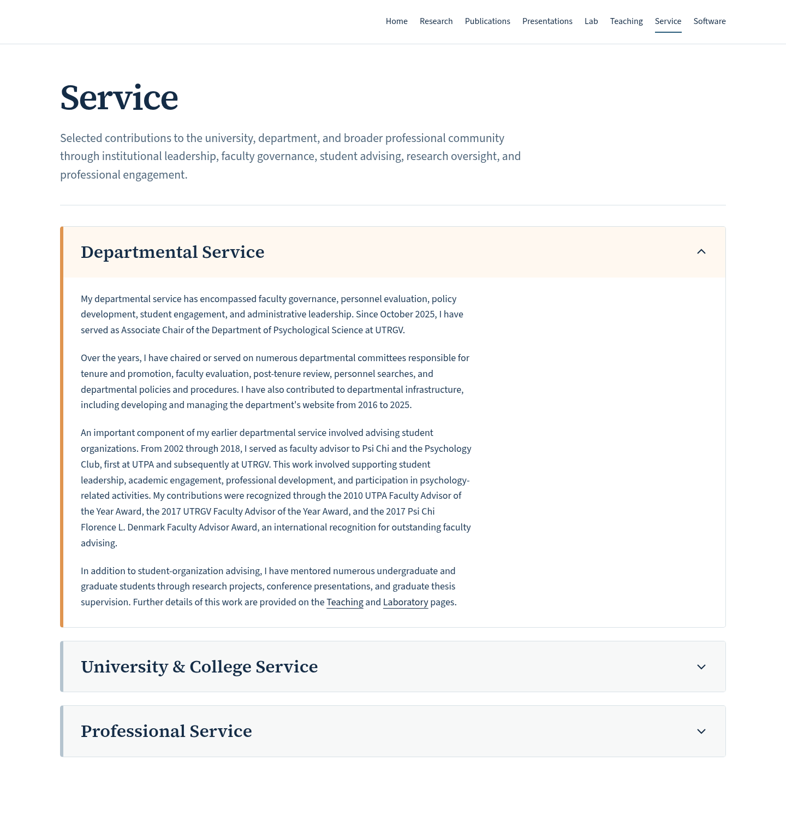
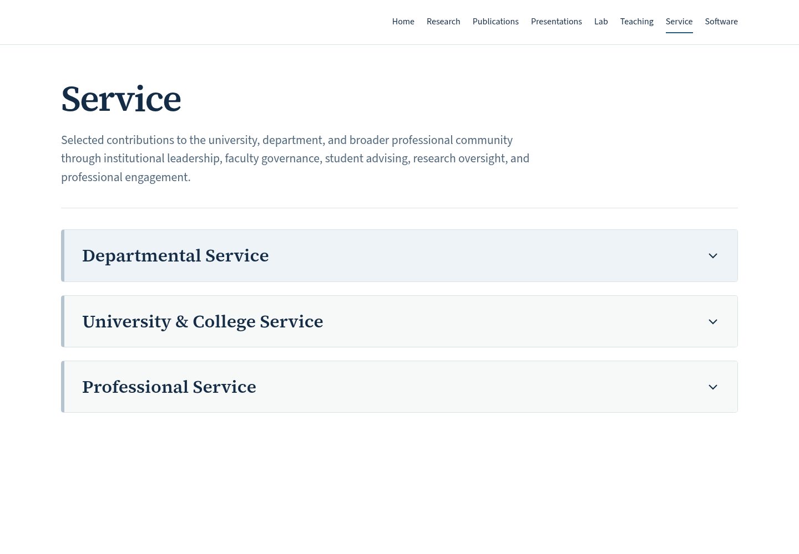
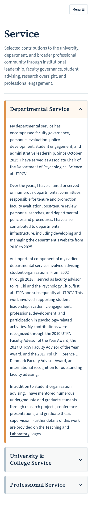
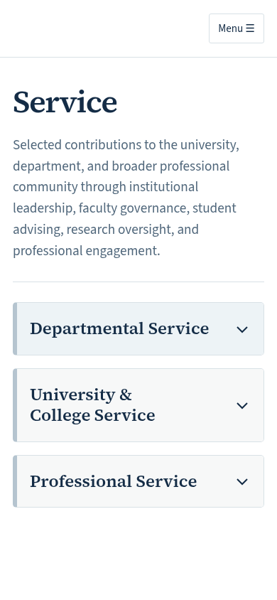

# Service page — review only

Nothing has been merged or published. The existing white design is preserved.

Departmental Service appears first and is expanded initially. University & College Service and Professional Service follow, initially collapsed. Each can be opened independently. Service is immediately before Software in desktop and mobile navigation.

All supplied narrative paragraphs are retained verbatim. Teaching and Laboratory link to their existing pages. No supplementary sections, university imagery, dependencies, or changes to existing page content were added.

Validation: Astro check passes with no errors or warnings; the static build and internal link/asset checks pass; all 24 browser tests pass. Tests cover keyboard activation, independent accordion toggles, accessibility, desktop/mobile navigation order, mobile overflow down to 320 pixels, existing publication search and abstracts, presentation filters, and other existing pages. Existing page sources, data, styles, and layouts are unchanged; the only shared site change is the requested navigation item.

## Desktop — Departmental Service expanded

## Desktop — all sections collapsed

## Mobile — Departmental Service expanded

## Mobile — all sections collapsed

